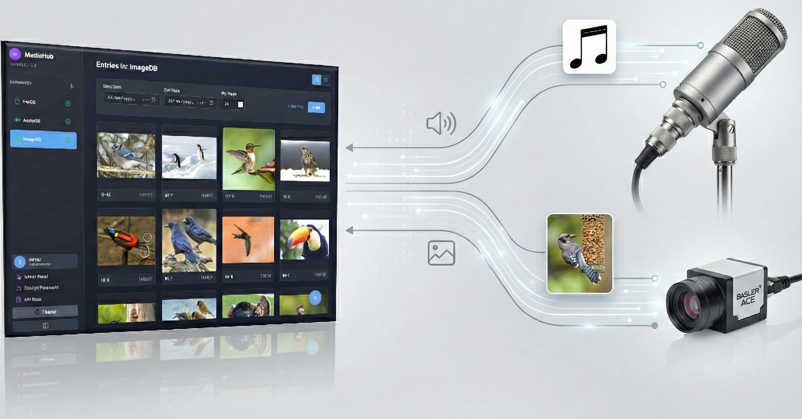

# MediaHub API & Web Interface (v1.1.0) ✨

This open source project provides a HTTP REST API and web frontend for storing, converting, auto-deleting, managing custom metadata and retrieving files, organized into distinct databases. The focus is on image and audio data, but generic files can be stored as well. The software has an optional dependency on ffmpeg for automatic audio transcoding and metadata extraction.

<p align="center">
  
</p>

Intended use-cases for the software are:

  * storing of camera data with metadata in a production environment, e.g., images for product quality checks, wildlife observation etc
  * storing of audio samples captured using microphones, e.g., for condition monitoring of machines, animal observation

You can find screenshots of what the frontend looks like in the [screenshots](/screenshots/) folder.

-----

## 🚀 Features

  * **Database Management:** Create, list, view details, update housekeeping rules, and delete files managed in databases.
  * **Dynamic Metadata:** Supports defining custom fields (e.g., `score`, `source`, `defect`) for each database. These fields are stored and indexed for efficient searching.
  * **Automated Housekeeping:** A background service periodically cleans up files based on configurable age (set to `0` to disable) and disk space limits (set to `0` to disable).
  * **Media Processing:** Configure databases to automatically perform actions like converting images to JPEG or audio files to FLAC. This relies on the optional FFmpeg dependency.
  * **Hybrid File Uploads:** Optimizes file uploads by processing small files **synchronously** (returning `201 Created`) and large files **asynchronously** (returning `202 Accepted`). The size threshold for this switch is configurable (default: 8MB). This provides immediate feedback to the user for large files, which can then be processed in the background.
  * **Integrated Web UI:** The Go application serves the Angular frontend from the embedded binary, providing a seamless user experience from a single executable.
  * **Drag & Drop Uploads:** Intuitive file uploading by dragging files directly onto the entry list or the upload modal.
  * **Preview Generation:** Automatically generates downscaled JPEG previews for images and waveform images for audio files (using FFmpeg) to enable fast-loading galleries.
  * **Advanced Entry Search:** The API supports powerful filtering on custom fields with operators like `>`, `<`, `>=`, `<=`, `!=`, and `LIKE` (for wildcard text search).
  * **Hybrid Authentication:** Supports both **Basic Authentication** (for simple API scripts) and **JWT (JSON Web Tokens)** with Access/Refresh tokens (for the Web UI), protected by role-based access control.
  * **Config-File Initialization:** On startup, can create users and databases from a TOML config file if they don't already exist.

-----

## 📥 Downloads

You can download prebuild binaries for different architectures using the provided links.

| Operating System | Architecture | Download Link |
| :--- | :--- | :--- |
| Linux | AArch64 (ARM 64-bit) | [mediahub\_linux\_aarch64](https://downloads.swcd.lu/MediaHub/v1.1.0/mediahub_linux_aarch64) |
| Linux | x86_64 (AMD/Intel 64-bit) | [mediahub\_linux\_x86\_64](https://downloads.swcd.lu/MediaHub/v1.1.0/mediahub_linux_x86_64) |
| Windows | x86_64 (AMD/Intel 64-bit) | [mediahub\_windows\_x86\_64.exe](https://downloads.swcd.lu/MediaHub/v1.1.0/mediahub_windows_x86_64.exe) |

A template `config.toml` file is also available for download [here](https://downloads.swcd.lu/MediaHub/v1.1.0/config.toml).

As an alternative, you can run a docker container using the [docker image](https://hub.docker.com/r/denglerchr/mediahub_oss) from Dockerhub.

```bash
docker run -d \
  --name mediahub \
  -p 8080:8080 \
  -v $(pwd)/mediahub_config:/config \
  -v $(pwd)/mediahub_storage:/storage \
  -e FDB_PASSWORD="your-secure-password" \
  denglerchr/mediahub_oss:latest
```

-----

## ▶️ Running the Application

After downloading or building the application, you need a `config.toml` file as well. Simply put it in the same folder, or start the binary with the `--config_path` option.
The binary will create `mediahub.db` and the `storage_root` directory in the same folder where it is run, unless configured otherwise.
You can then visit the web UI under the port you configured.

You can get a short help message with

```bash
./mediahub --help
```

### 1\. Admin User Setup

The application automatically manages an `admin` account with full permissions.

**On First Run:**
If no `admin` user is found in the database, the server will create one.

  * **With Password:** If you provide a password via the `--password` flag or `FDB_PASSWORD` environment variable, that password will be used.
    ```bash
    ./mediahub --password "my-secure-password"
    ```
  * **Without Password:** If no password is provided, a **random 10-character password** will be generated and **printed to the console**. Use this password to log in.
    ```
    ./mediahub
    INFO: No admin user found. Created 'admin' with password: 'aXbY12cZ34'
    ```

**Resetting the Admin Password:**
You can reset the `admin` user's password at any time by using the `--reset_pw=true` flag along with a new password.

```bash
# This will update the existing admin's password to "new-pass-123"
./mediahub --reset_pw=true --password "new-pass-123"
```

### 2\. Run the Server

From the project's root directory, execute the binary you built earlier:

```bash
# Make sure you are in the project root directory
./mediahub
```

The server will start, typically on `http://localhost:8080`.

### 3\. Access the Web Interface

  * Open your web browser and navigate to `http://localhost:8080`.
  * You will be directed to the login page. Use the admin credentials (e.g., `admin` / `my-secure-password`).

-----

## 🔧 Configuration

The application is configured using a hierarchy of settings. Any value set by a **command-line flag** will override a value set by an **environment variable**, which in turn overrides any value set in the **`config.toml` file**.

### 1\. Base Configuration (`config.toml`)

On startup, the application looks for a `config.toml` file in its working directory (or at the path specified by `--config_path`). This file defines the base settings for the server.

**Example `config.toml`:**

```toml
[server]
host = "localhost" # The host address to bind to
port = 8080        # The port for the HTTP server
max_sync_upload_size = "8MB" # Threshold for switching from synchronous (RAM) to asynchronous (Disk) processing

[database]
path = "mediahub.db"      # The path to the SQLite database file
storage_root = "storage_root" # The root directory where files will be stored

[logging]
level = "info" # The logging level (debug, info, warn, error)

[media]
# Optional: Path to the FFmpeg executable.
# If empty, the server will check the system PATH.
ffmpeg_path = ""

# Optional: Path to the FFprobe executable.
# If empty, the server will check near ffmpeg_path, then the system PATH.
ffprobe_path = ""
```

### 2\. Flags & Environment Variables (Overrides)

You can override any setting from the `config.toml` file using environment variables or command-line flags.

| Flag | Environment Variable | Description | Default |
| --- | --- | --- | --- |
| `--port` | `FDB_PORT` | Overrides `server.port` from `config.toml`. | `8080` |
| `--log-level` | `FDB_LOG_LEVEL` | Overrides `logging.level` from `config.toml`. | `info` |
| `--database-path` | `FDB_DATABASE_PATH` | Overrides `database.path` from `config.toml`. | `mediahub.db` |
| `--storage-root` | `FDB_STORAGE_ROOT` | Overrides `database.storage_root` from `config.toml`. | `storage_root` |
| `--ffmpeg-path` | `FDB_FFMPEG_PATH` | Overrides `media.ffmpeg_path` from `config.toml`. | `""` |
| `--ffprobe-path` | `FDB_FFPROBE_PATH` | Overrides `media.ffprobe_path` from `config.toml`. | `""` |
| `--max-sync-upload` | `FDB_MAX_SYNC_UPLOAD` | Overrides `server.max_sync_upload_size`. Sets memory threshold (e.g. "4MB", "1GB"). | `8MB` |
| `--config_path` | `FDB_CONFIG_PATH` | Path to the base TOML configuration file. | `config.toml` |
| `--password` | `FDB_PASSWORD` | The password for the 'admin' user (used on first run or with `--reset_pw`). | `""` |
| `--reset_pw` | `FDB_RESET_PW` | If `true`, resets the 'admin' password on startup to the one provided. | `false` |
| `--init_config` | `FDB_INIT_CONFIG` | Path to a TOML config file for one-time initialization of users/databases. | `""` |

### 3\. One-Time Initialization (`--init_config`)

You can provide a *separate* TOML configuration file on startup using the `--init_config` flag or the `FDB_INIT_CONFIG` environment variable. The server will read this file and **create any users or databases that do not already exist**. This is useful for automated deployments.

  * This process **will not overwrite** existing users or databases.
  * After a successful run, the server will **attempt to overwrite the init config file** to remove the plaintext `password` fields for security.
  * If this write fails (e.g., due to file permissions), the server will log a warning and continue, but you should **manually secure the file** to remove the passwords.

**Example Init Config (`my-init.toml`):**

```toml
[[user]]
name = "Viewer"
roles = ["CanView"]
password = "StrongPassword"

[[user]]
name = "MaxMustermann"
roles = ["CanView", "CanCreate", "CanEdit", "CanDelete"]
password = "DifferentPassword"

[[database]]
name = "ImageDB1"
content_type = "image"
config = { convert_to_jpeg = true, create_previews = true }
housekeeping = {
    interval = "1h",
    disk_space = "100G",
    max_age = "365d"
}
custom_fields = [
    {name = "latitude", type = "REAL"},
    {name = "longitude", type = "REAL"},
    {name = "ml_score", type = "REAL"},
    {name = "sensor_id", type = "TEXT"},
    {name = "description", type = "TEXT"}
]

[[database]]
name = "Audio_Archive"
content_type = "audio"
config = { create_previews = true, auto_conversion = "flac" }
housekeeping = {
    interval = "24h",
    disk_space = "500G",
    max_age = "0" # Disable age-based cleanup
}
custom_fields = [
    {name = "source", type = "TEXT"}
]
```

-----

## 🛠️ Prerequisites for Building

As mentioned you can just use prebuild binaries, but if you want to build the program yourself, you can will need the following.

  * **Go:** Version 1.24.3 or later (as specified in `go.mod`).
  * **C Compiler:** A C compiler (like `gcc` or `MinGW`) is required for `mattn/go-sqlite3` (CGO).
  * **Node.js & npm:** Required for building the frontend.
  * **Angular CLI:** The command-line interface for Angular. Install globally with `npm install -g @angular/cli`.
  * **(Optional) FFmpeg & FFprobe:** Required for:
      * Audio-to-FLAC/Opus conversion (`ffmpeg`).
      * Audio waveform preview generation (`ffmpeg`).
      * Metadata extraction (duration, channels) for MP3, FLAC, Ogg, etc. (`ffprobe`).
      * If not found, these features will be disabled. The paths can be configured in `config.toml` or via flags/env vars.

-----

## ⚙️ Building the Application

The build process compiles the Go backend with the Angular frontend embedded directly into the final executable. All commands should be run from the **root directory** of the project.

### 1\. (Optional) Generate API Documentation

If you have made changes to the API handlers, regenerate the Swagger documentation *before* building the frontend.

```bash
# Ensure you have the swag CLI tool installed
# go get -u [github.com/swaggo/swag/cmd/swag](https://github.com/swaggo/swag/cmd/swag)

# From the project root, regenerate the docs
swag init -g ./cmd/mediahub/main.go
```

The generated documentation is served at the `/swagger/index.html` endpoint.

### 2\. Build the Frontend (Angular UI)

This step builds the static Angular application and places the output files where the Go backend can find and embed them.

```bash
# Navigate into the frontend directory
cd frontend

# Install Node.js dependencies
npm install

# Build the static assets for production
ng build

# Go back to the root directory
cd ..
```

The `angular.json` file is configured to output the build to `cmd/mediahub/frontend_embed/`. This location is crucial for the Go compiler to find and embed the files.

### 3\. Build the Backend (Go API)

This final step compiles the Go application, embeds the frontend, and creates a single executable file.

**Important:** This project uses `mattn/go-sqlite3`, which requires CGO. You **must** enable CGO for the build to succeed.

**On Linux/macOS:**

```bash
# From the project root directory
CGO_ENABLED=1 go build -o mediahub ./cmd/mediahub
```

**On Windows (PowerShell):**

```powershell
# From the project root directory
$env:CGO_ENABLED=1
go build -o mediahub.exe ./cmd/mediahub
```

This command creates a single executable file named `mediahub` (or `mediahub.exe`) in your project root. This file contains the entire application, including the web UI.

-----

## 📚 Code Overview

The application is a monorepo containing two main parts:

1.  **Go Backend API (`/cmd`, `/internal`):**

      * Built using Go, `gorilla/mux` for routing, and `mattn/go-sqlite3` for database interactions.
      * Provides RESTful API endpoints under `/api/` for managing file "databases" and the entries within them.
      * Handles file uploads, storage on the filesystem, and metadata management in a local SQLite database.
      * Implements Basic Authentication with user roles (`CanView`, `CanCreate`, `CanEdit`, `CanDelete`).
      * Serves the static files for the Angular frontend, which are embedded directly into the binary.

2.  **Angular Frontend (`/frontend`):**

      * A single-page application built with the Angular framework.
      * Provides a user interface for logging in, viewing databases, uploading files, and editing entry details.
      * Uses Angular's built-in router for navigation and HttpClient for API communication.
      * Dynamically adapts the UI based on the authenticated user's permissions.

-----

## 💼 Support and commercial features

You can use the free version for commercial use cases without any restrictions.
If you are in need of software support or you are interested in a commercial version with additional, industrial features, please [contact me](denglerchr@gmail.com). 

Available commercial features include:

  * PostgreSQL and S3/MinIO/DeuxfleursGarage support, allowing horizontal scaling
  * single sign on via OIDC (e.g., using keycloak)

-----

## 🔣 Miscellaneous

While this application is not "vibe-coded", the development is heavily supported by AI code generation for coding efficiency. If you have a no-AI software policy, you should not use this program.