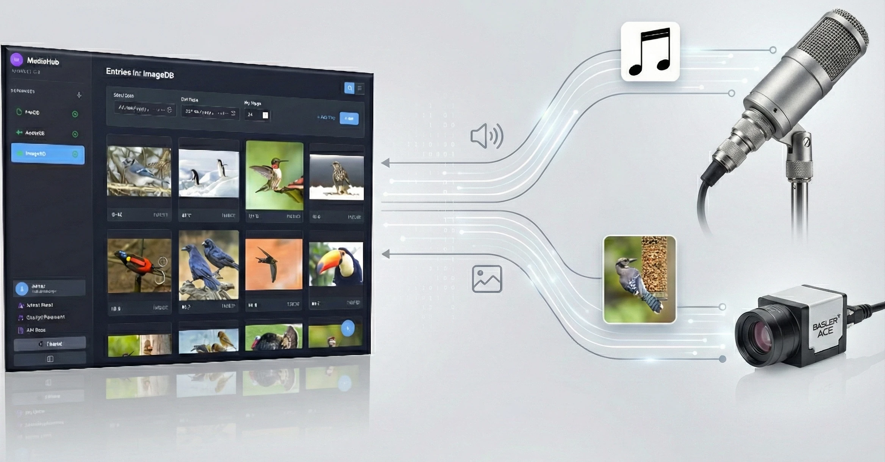

# MediaHub API & Web Interface (v2.0.0-beta1) ✨

This open source project provides a HTTP REST API and web frontend for storing, converting, auto-deleting, managing custom metadata and retrieving files, organized into distinct databases. The focus is on image, video and audio data, but generic files can be stored as well. The software has a dependency on ffmpeg for automatic transcoding of files and metadata extraction.

<p align="center">
  
</p>

Intended use-cases for the software are:

  * storing of camera data with metadata in a production environment, e.g., images or videos for product quality checks, wildlife observation etc
  * storing of audio samples captured using microphones, e.g., for condition monitoring of machines, animal observation

You can find screenshots of what the frontend looks like in the [screenshots](/screenshots/) folder.

-----

## 🚀 Features

  * **Database Management:** Create, list, view details, update housekeeping rules, and delete files managed in databases.
  * **Dynamic Metadata:** Supports defining custom fields (e.g., `score`, `source`, `defect`) for each database. These fields are stored and indexed for efficient searching.
  * **Automated Housekeeping:** A background service periodically cleans up files based on configurable age (set to `0` to disable) and disk space limits (set to `0` to disable).
  * **Media Processing:** Configure databases to automatically transcode media files, e.g., images to Webp, video to Webm or audio files to FLAC.
  * **Hybrid File Uploads:** Optimizes file uploads by processing small files **synchronously** (returning `201 Created`) and large files **asynchronously** (returning `202 Accepted`). The size threshold for this switch is configurable (default: 4MB). This provides immediate feedback to the user for large files, which can then be processed in the background.
  * **Integrated Web UI:** The Go application serves the Angular frontend from the embedded binary, providing a seamless user experience from a single executable.
  * **Drag & Drop Uploads:** Intuitive file uploading by dragging files directly onto the entry list or the upload modal.
  * **Preview Generation:** Automatically generates downscaled Webp previews for images or videos and waveform images for audio files (using FFmpeg) to enable fast-loading galleries.
  * **Advanced Entry Search:** The API supports powerful filtering on custom fields with operators like `>`, `<`, `>=`, `<=`, `!=`, and `LIKE` (for wildcard text search).
  * **Hybrid Authentication:** Supports both **Basic Authentication** (for simple API scripts) and **JWT (JSON Web Tokens)** with Access/Refresh tokens (for the Web UI), protected by role-based access control.
  * **Flexible User Roles:** User roles can be defined on database level, allowing fine grained access control.
  * **Audit Logging:** Optional logging of every action taken by users can be enabled for traceability. 
  * **Config-File Initialization:** On startup, can create users and databases from a TOML config file if they don't already exist.

-----

## 📥 Downloads

You can download prebuild binaries for different architectures using the provided links.

| Operating System | Architecture | Download Link |
| :--- | :--- | :--- |
| Linux | AArch64 (ARM 64-bit) | [mediahub\_linux\_aarch64](https://downloads.swcd.lu/MediaHub/v2.0.0-beta1/mediahub_linux_aarch64) |
| Linux | x86_64 (AMD/Intel 64-bit) | [mediahub\_linux\_x86\_64](https://downloads.swcd.lu/MediaHub/v2.0.0-beta1/mediahub_linux_x86_64) |
| Windows | x86_64 (AMD/Intel 64-bit) | [mediahub\_windows\_x86\_64.exe](https://downloads.swcd.lu/MediaHub/v2.0.0-beta1/mediahub_windows_x86_64.exe) |

A template `config.toml` file is also available for download [here](https://downloads.swcd.lu/MediaHub/v2.0.0-beta1/config.toml).

As an alternative, you can run a docker container using the [docker image](https://hub.docker.com/r/denglerchr/mediahub_oss) from Dockerhub.

```bash
docker run -d \
  --name mediahub \
  -p 8080:8080 \
  -v $(pwd)/mediahub_config:/config \
  -v $(pwd)/mediahub_storage:/storage \
  -e MEDIAHUB_PASSWORD="your-secure-password" \
  denglerchr/mediahub_oss:latest
```

-----

## ▶️ Running the Application

After downloading or building the application, you need a `config.toml` file as well. Simply put it in the same folder, or start the binary with the `--config_path` option.
The binary will create `mediahub.db` and the `storage_root` directory in the same folder where it is run, unless configured otherwise.
You can then visit the web UI under the port you configured.

You can get a short help message with

```bash
./mediahub --help
```

to start the server use

```bash
./mediahub serve
```

### 1\. Admin User Setup

The application automatically manages one or multiple `admin` account with full permissions.

**On First Run:**
If no `admin` user is found in the database, the server will create one.

  * **With Password:** If you provide a password via the `--password` flag or `MEDIAHUB_PASSWORD` environment variable, that password will be used.
    ```bash
    ./mediahub serve --password "my-secure-password"
    ```
  * **Without Password:** If no password is provided, a **random 10-character password** will be generated and **printed to the console**. Use this password to log in.

**Resetting the Admin Password:**
You can reset the `admin` user's password at any time by using the `--reset_pw=true` flag along with a new password.

```bash
# This will update the existing admin's password to "new-pass-123"
./mediahub serve --reset_pw=true --password "new-pass-123"
```

### 2\. Run the Server

From the project's root directory, execute the binary you built earlier:

```bash
# Make sure you are in the project root directory
./mediahub serve
```

The server will start, typically on `http://localhost:8080`.

### 3\. Access the Web Interface

  * Open your web browser and navigate to `http://localhost:8080`.
  * You will be directed to the login page. Use the admin credentials (e.g., `admin` / `my-secure-password`).

-----

## 🛠️ Maintenance Commands

In addition to the web server, the binary includes several maintenance tools accessible via subcommands.

### Database Recovery

If the server crashes during a file upload, some entries may get stuck in a "processing" state. The recovery command scans the database and fixes these inconsistencies.

```bash
# Runs the integrity check and fixes stuck entries (does not start the web server)
./mediahub recovery
```

### Database Migrations

You can manually manage the database schema versions using the `migrate` command. This is useful for upgrading the database structure explicitly. It is strongly advised to do a backup of the database before applying any migration.

```bash
# Check current migration status
./mediahub migrate status

# Apply all pending migrations (Up)
./mediahub migrate up

# Rollback the last migration (Down)
# Use with care and a backup of the database! This can permanently remove data!
./mediahub migrate down
```

-----

## 🔧 Configuration

The application is configured using a hierarchy of settings. Any value set by a **command-line flag** will override a value set by an **environment variable**, which in turn overrides any value set in the **`config.toml` file**.

### 1\. Base Configuration (`config.toml`)

On startup, the application looks for a `config.toml` file in its working directory (or at the path specified by `--config_path`). This file defines the base settings for the server.

**Example `config.toml`:**

```toml
[server]
host = "0.0.0.0"   # The host address to bind to
port = 8080        # Default port (can be overridden by flag/env)
basepath = "/"     # For the case of a reverse proxy
max_sync_upload_size = "8MB" # Threshold for switching from RAM to Disk processing
# cors_allowed_origins = ["http://localhost:4200"] # Noop in 2.0.0-beta1

[database]
source = "mediahub.db"

[storage.local]
root = "storage_root"


[logging]
level = "info" # Standard application logging level

[logging.audit]
type = "stdio" # Where to store audit logs: "stdio" or "database"
enabled = false # Toggle audit logging on or off
retention = "31d" # how long to store the logs in case of "database"

[media]
ffmpeg_path = ""
ffprobe_path = ""

[auth.jwt]
# Token expiration settings
access_duration = "5min"
refresh_duration = "24h"
# Secret is auto-generated and saved here if missing
secret = "..."
```

### 2\. Flags & Environment Variables (Overrides)

You can override any setting from the `config.toml` file using environment variables or command-line flags.

| Flag | Env Variable | Description | Default |
| --- | --- | --- | --- |
| **Operational & Startup Flags** |  | *(These do not map to `config.toml`)* |  |
| `--config_path` | `MEDIAHUB_CONFIG_PATH` | Path to the base TOML configuration file. | `config.toml` |
| `--init_config` | `MEDIAHUB_INIT_CONFIG` | Path to a TOML config file for one-time initialization of users/databases. | `""` |
| `--password` | `MEDIAHUB_PASSWORD` | The password for the 'admin' user (used on first run or with reset). | `""` |
| `--reset_pw` | `MEDIAHUB_RESET_PW` | If `true`, resets the 'admin' password on startup to the one provided. | `false` |
| **Server Settings** `[server]` |  |  |  |
| `--server-host` | `MEDIAHUB_SERVER_HOST` | The host address to bind to. | `0.0.0.0` |
| `--server-port` | `MEDIAHUB_SERVER_PORT` | The HTTP port to bind to. | `8080` |
| `--server-basepath` | `MEDIAHUB_SERVER_BASEPATH` | The base path in case the app is behind a reverse proxy. | `/` |
| `--server-max-sync-upload` | `MEDIAHUB_SERVER_MAX_SYNC_UPLOAD` | RAM threshold for uploads (e.g., "8MB"). Larger files use disk. | `8MB` |
| `--server-cors-origins` | `MEDIAHUB_SERVER_CORS_ORIGINS` | Comma-separated list of allowed CORS origins. | `""` |
| **Database Settings** `[database]` |  |  |  |
| `--database-source` | `MEDIAHUB_DATABASE_SOURCE` | Path to DB file or connection string. | `mediahub.db` |
| **Storage Settings** `[storage]` |  |  |  |
| `--storage-local-root` | `MEDIAHUB_STORAGE_LOCAL_ROOT` | Root directory for `local` file storage. | `storage_root` |
| **Logging Settings** `[logging]` |  |  |  |
| `--logging-level` | `MEDIAHUB_LOGGING_LEVEL` | Application logging verbosity (`debug`, `info`, `warn`, `error`). | `info` |
| `--logging-audit-type` | `MEDIAHUB_LOGGING_AUDIT_TYPE` | Where to store audit logs (`stdio` or `database`). | `stdio` |
| `--logging-audit-enabled` | `MEDIAHUB_LOGGING_AUDIT_ENABLED` | Toggle audit logging (`true`/`false`). | `false` |
| `--logging-audit-retention` | `MEDIAHUB_LOGGING_AUDIT_RETENTION` | In case of logging to database. | `31d` |
| **Media Settings** `[media]` |  |  |  |
| `--media-ffmpeg-path` | `MEDIAHUB_MEDIA_FFMPEG_PATH` | Path to FFmpeg executable. | `""` |
| `--media-ffprobe-path` | `MEDIAHUB_MEDIA_FFPROBE_PATH` | Path to FFprobe executable. | `""` |
| **Auth Settings** `[auth]` |  |  |  |
| `--auth-jwt-access-duration` | `MEDIAHUB_AUTH_JWT_ACCESS_DURATION` | Validity of the JWT. | `"5min"` |
| `--auth-jwt-refresh-duration` | `MEDIAHUB_AUTH_JWT_REFRESH_DURATION` | Validity of the refresh token. | `"24h"` |
| `--auth-jwt-secret` | `MEDIAHUB_AUTH_JWT_SECRET` | Secret key for signing JWTs. | `""` |

### 3\. One-Time Initialization (`--init_config`)

You can provide a *separate* TOML configuration file on startup using the `--init_config` flag or the `MEDIAHUB_INIT_CONFIG` environment variable. The server will read this file and **create any users or databases that do not already exist**. This is useful for automated deployments.

  * This process **will not overwrite** existing users or databases.
  * After a successful run, the server will **attempt to overwrite the init config file** to remove the plaintext `password` fields for security.
  * If this write fails (e.g., due to file permissions), the server will log a warning and continue, but you should **manually secure the file** to remove the passwords.

**Example Init Config (`my-init.toml`):**

```toml
# --- Users ---

# 1. Admin User
[[user]]
name = "AdminUser"
is_admin = true
password = "SuperSecretPassword"

# 2. Regular User with specific permissions
[[user]]
name = "Bob"
is_admin = false
password = "BobsPassword"

    # Bob's permissions for ImageDB1
    [[user.permissions]]
    database_name = "ImageDB1"
    can_view = true
    can_create = true
    can_edit = false
    can_delete = false

    # Bob's permissions for Audio_Archive
    [[user.permissions]]
    database_name = "Audio_Archive"
    can_view = true
    can_create = false
    can_edit = false
    can_delete = false


# --- Databases ---

[[database]]
name = "ImageDB1"
content_type = "image"
config = { create_previews = true, auto_conversion = "jpeg" }
housekeeping = { interval = "1h", disk_space = "100G", max_age = "365d" }
# Custom metadata schema
custom_fields = [
    {name = "latitude", type = "REAL"},
    {name = "longitude", type = "REAL"},
    {name = "description", type = "TEXT"}
]

[[database]]
name = "Audio_Archive"
content_type = "audio"
config = { create_previews = true, auto_conversion = "flac" }
housekeeping = { interval = "24h", disk_space = "500G", max_age = "0" } # Disable age-based cleanup
custom_fields = [
    {name = "source", type = "TEXT"}
]

[[database]]
name = "MyMovies"
content_type = "video"
config = { create_preview = true, auto_conversion = "mp4" }
housekeeping = { interval = "24h", disk_space = "1T", max_age = "730d" }
custom_fields = [
    {name = "director", type = "TEXT"},
    {name = "rating", type = "INTEGER"}
]

```


-----

## 🛠️ Prerequisites for Building

As mentioned you can just use prebuild binaries, but if you want to build the program yourself, you can will need the following.

  * **Go:** Version 1.26 or later (as specified in `go.mod`).
  * **Node.js & npm:** Required for building the frontend.
  * **Angular CLI:** The command-line interface for Angular. Install globally with `npm install -g @angular/cli`.
  * **FFmpeg & FFprobe:** Required for transcoding, preview generation and metadata extraction.

-----

## ⚙️ Building the Application

The build process compiles the Go backend with the Angular frontend embedded directly into the final executable. All commands should be run from the **root directory** of the project.

### 1\. (Optional) Generate API Documentation

If you have made changes to the API handlers, regenerate the Swagger documentation *before* building the frontend.

```bash
# Ensure you have the swag CLI tool installed
# go get -u [github.com/swaggo/swag/cmd/swag](https://github.com/swaggo/swag/cmd/swag)

# From the project root, regenerate the docs
swag init -g ./cmd/mediahub/main.go
```

The generated documentation is served at the `/swagger/index.html` endpoint.

### 2\. Build the Frontend (Angular UI)

This step builds the static Angular application and places the output files where the Go backend can find and embed them.

```bash
# Navigate into the frontend directory
cd frontend

# Install Node.js dependencies
npm install

# Build the static assets for production
npm run build

# Go back to the root directory
cd ..
```

The `angular.json` file is configured to output the build to `cmd/mediahub/frontend_embed/`. This location is crucial for the Go compiler to find and embed the files.

### 3\. Build the Backend (Go API)

This final step compiles the Go application, embeds the frontend, and creates a single executable file.

**On Linux/macOS:**

```bash
# From the project root directory
go build -o mediahub ./cmd/mediahub
```

**On Windows (PowerShell):**

```powershell
# From the project root directory
go build -o mediahub.exe ./cmd/mediahub
```

This command creates a single executable file named `mediahub` (or `mediahub.exe`) in your project root. This file contains the entire application, including the web UI.

-----

## 📚 Code Overview

The application is a monorepo containing two main parts:

1.  **Go Backend API (`/cmd`, `/internal`):**

      * Provides RESTful API endpoints under `/api/` for managing file "databases" and the entries within them.
      * Handles file uploads, storage on the filesystem, and metadata management in a local SQLite database.
      * Serves the static files for the Angular frontend, which are embedded directly into the binary.

2.  **Angular Frontend (`/frontend`):**

      * A single-page application built with the Angular framework.
      * Provides a user interface for logging in, viewing databases, uploading files, and editing entry details.
      * Uses Angular's built-in router for navigation and HttpClient for API communication.
      * Dynamically adapts the UI based on the authenticated user's permissions.

-----

## 💼 Support and commercial features

You can use the free version for commercial use cases without any restrictions.
If you are in need of software support or you are interested in a commercial version with additional, industrial features, please [contact me](denglerchr@gmail.com). 

Available commercial features include:

  * PostgreSQL and S3/MinIO/DeuxfleursGarage support, allowing horizontal scaling
  * single sign on via OIDC (e.g., using keycloak)

-----

## 🔣 Miscellaneous

While this application is not "vibe-coded", the development is heavily supported by AI code generation for coding efficiency. If you have a no-AI software policy, you should not use this program.